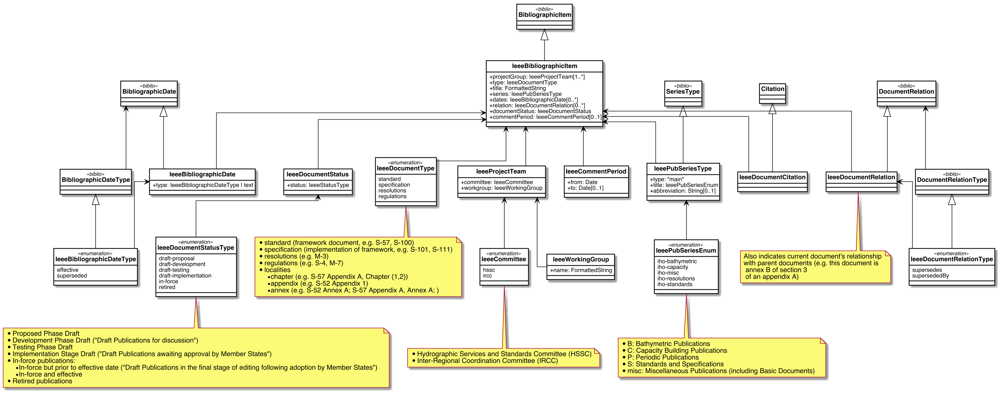

image:https://github.com/relaton/relaton-model-ieee/workflows/make/badge.svg["Build Status", link="https://github.com/relaton/relaton-model-ieee/actions/workflows/make.yml"]

= Relaton IEEE Models

This is where we keep the Relaton IEEE model definitions.

The IEEE Relaton model is an instance of the
https://github.com/relaton/relaton-models[Relaton model].

Details of the general model can be found on its page.

== IEEE Bibliographic Item Model

