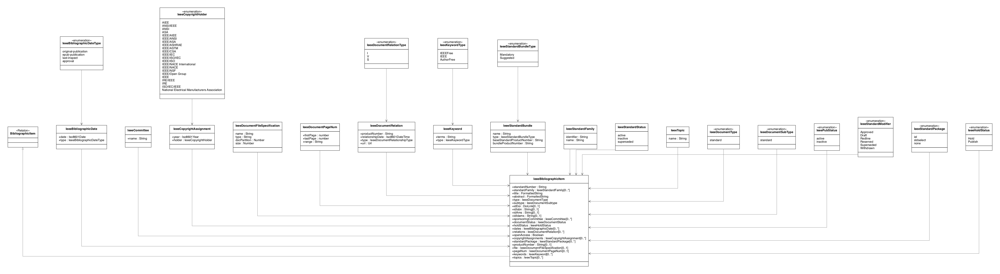
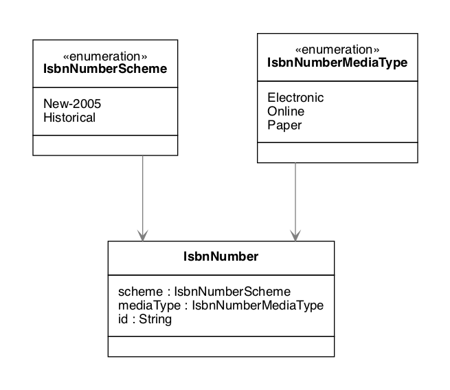

= Relaton IEEE Bibliographic Data Model

This bibliographic model is developed to consolidate and standardize
the data model used for bibliographic and citation purposes.

This model is meant to be fully compatible with ISO 690 and
ISO TC 46's (and SC 4, SC 9) work on bibliography.

These models were developed based on the `IEEE//IDAMS Exchange V2.0.0//EN" "ieee_idams_exchange.dtd"` model.

NOTE: The modelled components represent a subset of the XML model; omitted
elements are implementation details that are not important in the generation of
bibliographic data.

image:https://github.com/relaton/relaton-model-ieee/workflows/make/badge.svg["Build Status", link="https://github.com/relaton/relaton-model-ieee/actions/workflows/make.yml"]

== IEEE Metadata UML Models

== ISBN Number Model

