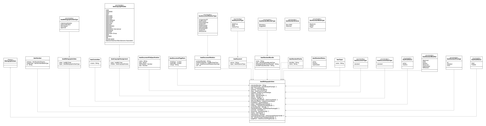

= Relaton IeeeBibliographic Model

This bibliographic model is developed to consolidate and standardize
the data model used for bibliographic and citation purposes.

This model is meant to be fully compatible with ISO 690 and
ISO TC 46's (and SC 4, SC 9) work on bibliography.

image:https://github.com/relaton/relaton-model-ieee/workflows/make/badge.svg["Build Status", link="https://github.com/relaton/relaton-model-ieee/actions/workflows/make.yml"]

== IEEE Metadata UML Models

== ISBN Number Model

